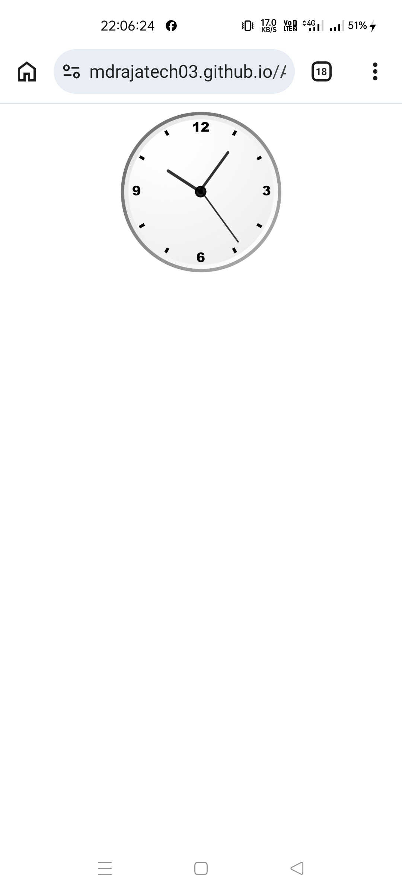

# Analog Clock ⏰

A beautiful, real-time **analog clock** built with pure **HTML, CSS, and JavaScript**. It displays the current system time with smoothly rotating hour, minute, and second hands on a classic circular dial (1–12).

Live 🌐 Demo: [Open in Browser](https://mdrajatech03.github.io/Analog-Clock/)  

**Screenshot**

## ✨ Features
- Real-time clock updates every second
- Smooth hand rotations using CSS transforms
- Clean and minimal design
- Responsive (works on mobile/desktop)
- Uses vanilla JavaScript (no libraries/frameworks)

## 🛠️ Technologies Used
- HTML5
- CSS3 (Flexbox, Transforms, Animations)
- JavaScript (Date API + setInterval)

## 🚀 How to Run Locally
1. **Rajatech**
GitHub: https://github.com/mdrajatech03
